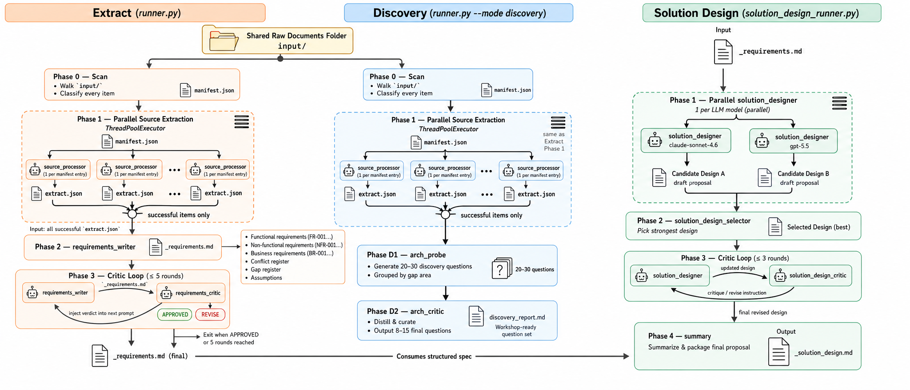
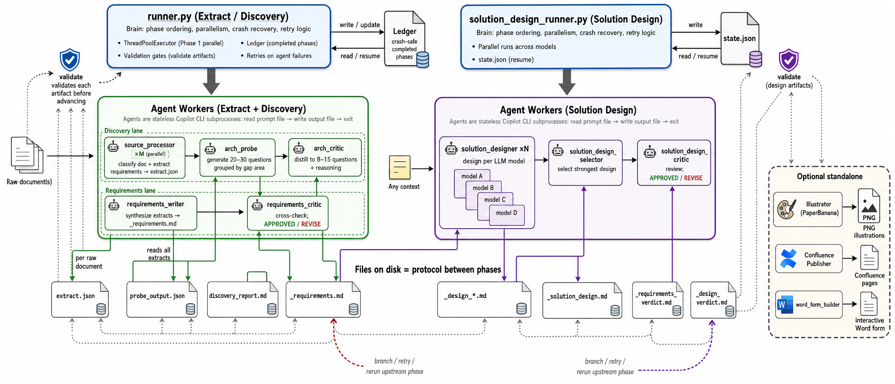

# prism

**prism** takes a folder of raw client documents — RFPs, proposals, meeting notes, PDFs, spreadsheets — and turns them into polished technical deliverables: a structured requirements spec, a curated set of architect discovery questions, and a full solution design proposal. You drop files in, the pipeline runs, you get documents out.

Internally it is a multi-agent AI system. GitHub Copilot CLI agents do the reading and writing; Python runners handle the orchestration — phase ordering, parallelism, crash recovery, and retry logic. Every hand-off between phases is a file on disk, so any step can be resumed after a failure without re-running completed work.

Three pipelines, same input folder:

| Pipeline | Runner | Input | Output | When to use |
|---|---|---|---|---|
| **Extract** | `runner.py` | Raw documents in `input/` | `_requirements.md` | Structured FR/NFR/BR spec from unstructured sources |
| **Discovery** | `runner.py --mode discovery` | Raw documents in `input/` | `discovery_report.md` | Curated architect questions before a workshop |
| **Solution Design** | `solution_design_runner.py` | `_requirements.md` | `_solution_design.md` | Full technical solution proposal from a spec |

---

## Pipelines

<!-- ILLUSTRATION: type=pipeline, section=Pipelines, description="Pure white background (#FFFFFF). Three parallel vertical pipelines side by side filling the full canvas. LEFT pipeline labeled 'Extract' in green: Phase 0 Scan → Phase 1 parallel source_processor boxes → Phase 2 requirements_writer → Phase 3 critic loop (requirements_critic ↔ requirements_writer, up to 5 rounds) → output _requirements.md. CENTER pipeline labeled 'Discovery' in blue: Phase 0 Scan → Phase 1 parallel source_processor boxes → Phase D1 arch_probe (20-30 questions) → Phase D2 arch_critic (8-15 questions) → output discovery_report.md. RIGHT pipeline labeled 'Solution Design' in purple: input _requirements.md → Phase 1 parallel solution_designer boxes (one per model: claude-sonnet-4.6, gpt-5.5) → Phase 2 solution_design_selector → Phase 3 critic loop (solution_design_critic ↔ solution_designer, up to 3 rounds) → Phase 4 summary → output _solution_design.md. Each pipeline is a top-to-bottom flow with labeled boxes and arrows. Shared input/output files shown as document icons. Fill the entire canvas. No empty margins or padding around the diagram." -->



*Fig. 1. Three pipelines — Extract, Discovery, and Solution Design — all orchestrated by Python runners. Extract and Discovery share Phase 0 and Phase 1 (parallel source extraction). Solution Design takes a finished requirements doc as input and produces a committed architecture proposal.*

Two modes, same input:

| Mode | Flag | What it produces | When to use |
|---|---|---|---|
| `extract` | `--mode extract` (default) | `_requirements.md` — FR / NFR / BR / conflicts / gaps | When you need a structured spec from raw source docs |
| `discovery` | `--mode discovery` | `discovery_report.md` — curated architect questions per gap, AI-detection assessment | Before a workshop; when you need to understand what's missing |

---

## Quick Start

```bash
# Clone and set up
git clone <repo>
cd prism
python3 -m venv .venv && .venv/bin/pip install loguru pyyaml

# Configure
cp .env.example .env   # add OPENAI_API_KEY (for Illustrator agent)

# Run requirements extraction (default mode)
python3 runner.py run /path/to/project/input

# Run discovery
python3 runner.py run /path/to/project/input --mode discovery

# Run solution design (after extraction)
.venv/bin/python3 solution_design_runner.py run \
  /path/to/project/requirements_YYYYMMDD_HHMMSS/_requirements.md \
  --models claude-sonnet-4.6 gpt-5.5

# Resume interrupted solution design
.venv/bin/python3 solution_design_runner.py resume \
  /path/to/project/solution_design_YYYYMMDD_HHMMSS

# Interactive (HITL pauses at checkpoints)
python3 runner.py run /path/to/project/input --interactive

# Verbose logging
python3 runner.py run /path/to/project/input --debug
```

### `runner.py` flags

| Flag | Default | Description |
|---|---|---|
| `--mode` | `extract` | `extract` or `discovery` |
| `--interactive` | off | Pause at HITL checkpoints for clarification |
| `--no-interactive` | — | Explicitly skip all HITL pauses (headless) |
| `--debug` | off | Enable DEBUG-level logging to stderr |

### `solution_design_runner.py` flags

| Subcommand | Argument | Default | Description |
|---|---|---|---|
| `run` | `requirements_path` | — | Path to `_requirements.md` |
| `run` | `--models MODEL [...]` | `claude-sonnet-4.6 gpt-5.5` | Models for parallel Phase 1 |
| `run` | `--verbose` / `-v` | off | DEBUG logging to stderr |
| `resume` | `output_dir` | — | Output dir containing `state.json` |
| `resume` | `--verbose` / `-v` | off | DEBUG logging to stderr |

---

## Input: What Goes in `input/`

Drop any combination of:

- `.pdf` — RFP documents, proposals, specs (read via `mcp_pdf-reader`)
- `.docx` / `.pptx` / `.xlsx` — Office documents
- `.md` / `.txt` — meeting notes, briefs, chat exports
- `.png` / `.jpg` / `.jpeg` / `.webp` — screenshots, architecture images (read via vision)
- Subfolders — treated as a single logical source (one agent per folder)
- `.txt` files containing URLs — Confluence pages fetched via MCP; plain URLs fetched directly

**Excluded automatically:** `plan/`, `.git/`, any folder starting with `_artifacts`.

---

## Output Structure

Every run creates a **self-contained timestamped folder** sibling to `input/`:

```
project/
  input/                              ← your source documents (untouched)
  requirements_20260521_152709/       ← or discovery_20260521_...
    _requirements.md                  ← the deliverable
    plan/
      params.yaml                     ← run parameters (editable before re-run)
    _artifacts_20260521_152709/
      runner.log
      intake/
        manifest.json                 ← all scanned entries with extract status
      extracts/
        <slug>/
          extract.json                ← structured output per source
          raw.txt                     ← raw agent response
          agent.jsonl                 ← full copilot CLI JSONL log
        _requirements_writer/
          agent.jsonl
        _requirements_critic_r1/
          verdict.md                  ← VERDICT: APPROVED / REVISE
          agent.jsonl
      prompts/
        <slug>.md                     ← task prompt sent to each agent
        _requirements_writer.md
        _requirements_critic_r1.md
```

---

## Pipeline Details

### Extract Mode — 4 Phases

```
Phase 0 → Phase 1 (parallel) → Phase 2 → Phase 3 (loop)
  scan      source_processor    writer     critic ↔ writer
```

#### Phase 0 — Scan + Manifest

`runner.py` walks `input/`, classifies every item, builds `manifest.json`:

| Entry kind | What it is | Read tool |
|---|---|---|
| `file` | Single `.pdf`, `.docx`, `.md`, image, etc. | `mcp_pdf-reader` / `vision` / `read` |
| `subfolder` | A directory of related files | `mixed` / `read` |
| `url` | URL from a `.txt` file | `mcp_confluence` or `fetch` |

#### Phase 1 — Parallel Source Extraction

One `source_processor` agent per manifest entry, all launched concurrently via `ThreadPoolExecutor`. Each agent:

- identifies the document type (transcript / chat / brief / PDF / spreadsheet / QA)
- applies the matching extraction strategy
- outputs `extract.json` with: `requirements`, `decisions`, `constraints`, `open_questions`, `trust_level`

Agent timeout: **20 minutes** per agent. Heartbeat printed every 10 s:

```
[16:09:10] [rfp-doc] start
[16:09:20] [rfp-doc] running... 10s elapsed, timeout in 1190s
[16:09:41] [rfp-doc] done
```

**HITL:clarify (if `--interactive`).** If any agent returns `needs_clarification: true`, runner pauses and prompts the user in terminal. Answered agents are re-run with the clarification appended to the prompt. Up to **2 clarification rounds**.

#### Phase 2 — Requirements Writer

`requirements_writer` reads all successful `extract.json` files and synthesises `_requirements.md`:

- Functional requirements (FR-001, FR-002, …)
- Non-functional requirements (NFR-001, …)
- Business requirements (BR-001, …)
- Conflict register — contradictions between sources
- Gap register — unanswered questions
- Assumptions

Output validated: must contain `# Requirements:` title and at least one `FR-` entry.

#### Phase 3 — Critic ↔ Writer Loop

`requirements_critic` reads `_requirements.md`, cross-checks against source extracts, writes a verdict:

```
VERDICT: APPROVED          ← loop ends, document is final
VERDICT: REVISE
- Section 2.1: missing NFR for ...
- Conflict FR-004 vs FR-017 unresolved
```

If `REVISE` — verdict is injected into the writer's next prompt and `requirements_writer` runs a revision. This repeats until **`APPROVED`** or the **safety cap of 5 rounds** (`MAX_CRITIC_ROUNDS`). Hitting the cap is a warning, not a failure — the document is kept as-is.

---

### Discovery Mode — 4 Phases

```
Phase 0 → Phase 1 (parallel) → Phase D1 → Phase D2
  scan      source_processor    probe      critic
```

Phases 0 and 1 are identical to Extract mode.

#### Phase D1 — arch_probe

Reads all `extract.json` files and:

- scores each source for AI-generation signals (produces `ai_detection` section)
- runs Tavily web searches for domain context
- generates **20–30 raw discovery questions** — each tied to a specific gap or contradiction
- writes structured JSON to `_arch_probe/probe_output.json`

#### Phase D2 — arch_critic

Reads `probe_output.json` and:

- rejects generic or answerable questions
- curates **8–15 questions** that block architecture decisions if unanswered
- writes `discovery_report.md` directly to the output folder

---

### Solution Design Pipeline — `solution_design_runner.py`

Takes a finished `_requirements.md` and produces `_solution_design.md` — a single committed architecture: stakeholder map, phased delivery plan, deep-dive scenarios, NFRs, infrastructure reference. No options menu, no estimates.

```
Phase 1 (parallel) → Phase 2 → Phase 3 (loop) → Phase 4
  N × solution_designer   selector   critic ↔ designer   summary
```

#### Phase 1 — Parallel Generation

One `solution_designer` agent per model, all launched concurrently via `ThreadPoolExecutor`. Each agent:

- reads the requirements document and runs Tavily web searches
- produces `_design_<model_slug>.md` — full solution design in one committed architecture
- writes directly to the output file via the `write` tool

Default models: `claude-sonnet-4.6`, `gpt-5.5`. Override with `--models`.

Each candidate is an independent step tracked in `state.json`. If one model fails, the pipeline continues with the survivors.

#### Phase 2 — Selection

If only one candidate succeeded: copied as `_solution_design.md`, `_selection_report.md` records the sole winner.

If multiple candidates succeeded: `solution_design_selector` reads all candidates and:
- picks the strongest one architecture (writes it to `_solution_design.md`)
- writes `_selection_report.md` containing `WINNING_MODEL: <model>` on the first line

If the selector agent itself fails: first successful candidate is used as a fallback.

#### Phase 3 — Critic Loop

`solution_design_critic` reviews `_solution_design.md` against the requirements and writes a verdict:

```
VERDICT: APPROVED          ← loop ends, document is final
VERDICT: REVISE
## Issues
- Section 3.1: NFR for data residency missing
- Phase 2 exit criterion unclear
```

If `REVISE` — issues block is injected into a revision prompt and `solution_designer` runs again with the winning model. The revised output replaces `_solution_design.md`. This repeats until `APPROVED` or the **safety cap of 3 rounds** (`MAX_CRITIC_ROUNDS`). Hitting the cap is a warning, not a failure.

#### Phase 4 — Summary

Prints paths to all output artifacts, the winning model, final critic verdict, and the count of `<!-- ILLUSTRATION: -->` placeholders embedded for the Illustrator agent.

#### Quick Start

```bash
# Run solution design pipeline
.venv/bin/python3 solution_design_runner.py run \
  /path/to/project/requirements_YYYYMMDD_HHMMSS/_requirements.md \
  --models claude-sonnet-4.6 gpt-5.5

# Resume after crash
.venv/bin/python3 solution_design_runner.py resume \
  /path/to/project/solution_design_YYYYMMDD_HHMMSS

# Verbose logging
.venv/bin/python3 solution_design_runner.py run <path> --verbose
```

#### CLI Reference — `solution_design_runner.py`

| Subcommand | Argument | Default | Description |
|---|---|---|---|
| `run` | `requirements_path` | — | Path to `_requirements.md` |
| `run` | `--models MODEL [MODEL ...]` | `claude-sonnet-4.6 gpt-5.5` | Models for parallel Phase 1 generation |
| `run` | `--verbose` / `-v` | off | Enable DEBUG-level logging to stderr |
| `resume` | `output_dir` | — | Path to the output dir (must contain `state.json`) |
| `resume` | `--verbose` / `-v` | off | Enable DEBUG-level logging to stderr |

#### Output Structure — Solution Design

```
project/
  requirements_20260521_152709/       ← input (untouched)
    _requirements.md
  solution_design_20260601_152115/    ← sibling to requirements folder
    _solution_design.md               ← final deliverable
    _design_claude-sonnet-4_6.md      ← Phase 1 candidate (claude)
    _design_gpt-5_5.md                ← Phase 1 candidate (gpt)
    _selection_report.md              ← Phase 2 selector report (WINNING_MODEL: ...)
    _verdict_round1.md                ← Phase 3 critic verdict(s)
    _design_revised_r1.md             ← Phase 3 revision (if REVISE)
    state.json                        ← crash-safe ledger
    prompts/
      designer_claude-sonnet-4_6_prompt.txt
      designer_gpt-5_5_prompt.txt
      selector_prompt.txt
      critic_prompt_r1.txt
      revision_prompt_r1.txt
    logs/
      designer-claude-sonnet-4.6.jsonl
      designer-claude-sonnet-4.6.stderr.txt
      selector.jsonl
      critic-r1.jsonl
```

#### Crash Recovery

`state.json` is written atomically after every step (`tmp → os.replace`). Any step with status `running` at startup is reset to `pending`. Resume with the `resume` subcommand — already-completed steps are skipped, failed steps are retried.

---

<!-- ILLUSTRATION: type=architecture, section=Architecture, description="Pure white background (#FFFFFF). Central architecture diagram showing the relationship between Python runners and Copilot CLI agents. TOP row: two Python runner boxes — 'runner.py (Extract / Discovery)' in green and 'solution_design_runner.py (Solution Design)' in purple — side by side. Each runner has a label 'Brain: phase ordering, parallelism, crash recovery, retry logic'. MIDDLE: thick arrows pointing DOWN from each runner to their respective agent groups. LEFT group under runner.py (green border): source_processor, arch_probe, arch_critic, requirements_writer, requirements_critic — each as a rounded box labeled with agent name and role. RIGHT group under solution_design_runner.py (purple border): solution_designer ×N, solution_design_selector, solution_design_critic — each as a rounded box. BOTTOM: a horizontal row of file/document icons representing disk artifacts: extract.json, _requirements.md, probe_output.json, discovery_report.md, _design_*.md, _solution_design.md, _verdict_*.md — labeled as 'Files on disk = protocol between phases'. Thin arrows connect agents to their input/output files. STANDALONE agents in a separate box on the far right: Illustrator, Confluence Publisher, word_form_builder — labeled 'Optional standalone'. Fill the entire canvas. No empty margins or padding around the diagram." -->



*Fig. 2. Python runners are the brain — deterministic phase ordering, parallelism via ThreadPoolExecutor, crash-safe Ledger. Agents are stateless Copilot CLI subprocesses. Files on disk are the protocol between phases.*

### Three principles

**Python = brain.** All phase ordering, branching, retry limits, and parallelism live in `runner.py`. Agents have zero orchestration logic.

**Agents = stateless workers.** Each agent is a `.agent.md` file in `.github/agents/`. Invoked as a `copilot` CLI subprocess — reads a task prompt from disk, writes output to disk, exits.

**Files = protocol.** Every inter-phase handoff is a file on disk. `runner.py` validates each file before proceeding to the next phase.

### Agent invocation

```python
cmd = [
    "copilot",
    "-p", f"Read your task from: {prompt_file}",
    "--agent", agent_name,
    "--output-format", "json",
    "--allow-all",
    "--no-ask-user",
    "--add-dir", str(REPO_ROOT),   # gives agent access to prompts/ and .github/
]
if model:
    cmd += ["--model", model]
proc = subprocess.run(cmd, capture_output=True, text=True, timeout=1200)
```

---

## Agents

All 12 agents live in `.github/agents/`. Each is a `.agent.md` file with a YAML frontmatter declaring `name`, `description`, `model`, and `tools`.

| Agent | Pipeline | Role | Input | Output |
|---|---|---|---|---|
| `source_processor` | Extract / Discovery | Reads one source document (file, folder, URL), identifies its type, extracts requirements data | Any file/folder/URL from `input/` | `extract.json` |
| `arch_probe` | Discovery | Scores sources for AI-generation signals, runs domain web searches, generates raw discovery questions | All `extract.json` files | `probe_output.json` (20–30 questions) |
| `arch_critic` | Discovery | Filters raw questions, curates the decision-blocking subset | `probe_output.json` | `discovery_report.md` (8–15 questions) |
| `requirements_writer` | Extract | Synthesises all extracts into a structured requirements document; on revision rounds receives critic feedback | All `extract.json` files + optional critic verdict | `_requirements.md` |
| `requirements_critic` | Extract | Reviews requirements doc against source extracts; writes an APPROVED or REVISE verdict with per-section feedback | `_requirements.md` + extracts | `verdict.md` |
| `solution_designer` | Solution Design | Produces a publication-quality solution design: single committed architecture, stakeholder map, phased delivery, NFRs, infrastructure reference | `_requirements.md` | `_design_<model>.md` |
| `solution_design_selector` | Solution Design | Compares N candidate designs, selects the strongest one, writes `WINNING_MODEL:` to the report | N `_design_*.md` files | `_solution_design.md` + `_selection_report.md` |
| `solution_design_critic` | Solution Design | Reviews the design against requirements; writes APPROVED or REVISE with `## Issues` block | `_solution_design.md` | `_verdict_roundN.md` |
| `orchestrator` | Interactive wrapper | VS Code chat agent; starts `runner.py` in terminal, surfaces HITL checkpoints, routes user answers back | User chat input | Terminal commands + `vscode_askQuestions` prompts |
| `Illustrator` | Standalone | Generates publication-quality PNG illustrations using PaperBanana (Retriever → Planner → Stylist → Visualizer ↔ Critic sub-pipeline) | `<!-- ILLUSTRATION: -->` placeholders in any Markdown doc | PNG files + embedded captions |
| `Confluence Publisher` | Standalone | Publishes a finalized Markdown document to Confluence — converts to XHTML, creates/updates page, uploads PNG attachments via REST API | `_requirements.md` or `_solution_design.md` + illustrations | Confluence page with embedded images |
| `word_form_builder` | Standalone | Generates an interactive Word `.docx` clarification form — native SDT checkboxes, dropdowns, pre-filled tables; options enriched via Tavily | `_requirements.md` + extracts | `clarification_form_rN.docx` |

### Agent invocation

Every agent is called as a Copilot CLI subprocess:

```bash
copilot \
  -p "Read your task from: /path/to/prompt.txt" \
  --agent <agent_name> \
  --output-format json \
  --allow-all \
  --no-ask-user \
  --add-dir /path/to/prism \
  --add-dir /path/to/extra/dir \
  --model <model>
```

The runner writes a task prompt to disk before each invocation, then reads `stdout` as JSONL and checks whether the expected output artifact appeared on disk. `stderr` is saved to `logs/<slug>.stderr.txt` for diagnostics.

---

## Optional Standalone Agents

These agents are **not part of any automated pipeline** — invoke directly after a pipeline run.

### `Confluence Publisher`

```bash
export CONFLUENCE_URL="https://your-confluence.example.com"
export CONFLUENCE_PERSONAL_TOKEN="<your-PAT>"

.venv/bin/python .github/skills/confluence-publisher/scripts/publish_to_confluence.py \
  --draft path/to/_requirements.md \
  --illustrations path/to/illustrations/ \
  --parent-id <parent-page-id> \
  --space <SPACE_KEY>
```

> Image upload uses direct REST API calls — MCP Confluence tools do not support attachment upload.

### `word_form_builder`

Typically invoked after the Extract pipeline, before a client workshop.

**Input:** `_requirements.md` + extracts directory  
**Output:** `clarification_form_r<N>.docx`

---

## Interactive Mode (HITL)

Run via the `@orchestrator` agent in VS Code chat:

```
@orchestrator analyze /path/to/project/input
```

The orchestrator starts the pipeline and surfaces decision points:

| Checkpoint | Phase | What happens |
|---|---|---|
| Source clarification | Phase 1 | Agent flagged `needs_clarification` — user provides context, agent re-runs |
| Conflicts | Phase 2 | User picks winner between contradicting sources |
| Final review | Phase 3 | User can accept APPROVED verdict or force another revision |

Headless (default):

```bash
python3 runner.py run /path/to/input           # --no-interactive is default
python3 runner.py run /path/to/input --debug   # verbose logs to stderr
```

---

## Configuration

`plan/params.yaml` is created on first run with defaults. Edit before re-running:

```yaml
industry: fintech
project_type: software
domain_tags: [payments, SWIFT, KYC]

models: {}   # override per-agent model if needed

trust_policy:
  auto_resolve: true
  escalate_on: [scope, budget, architecture, security]
```

---

## Required MCP Servers

MCP servers are configured in VS Code (`mcp.json`) and used by agents as copilot tools.

| MCP Server | Used by | When needed |
|---|---|---|
| `pdf-reader` | `source_processor` | Any PDF files in `input/` |
| `tavily-remote` | `arch_probe`, `requirements_writer`, `solution_designer` | Always — web searches for domain context enrichment |
| `mcp-atlassian` (Confluence) | `source_processor` | `.txt` files containing `confluence.scnsoft.com` URLs |

Configure in VS Code: **Settings → MCP** or `~/.config/copilot/mcp.json`.

---

`.env` (required for Illustrator agent only):

```
OPENAI_API_KEY=sk-...
```

---

## Project Structure

```
prism/
  runner.py                          ← Extract / Discovery pipeline orchestrator
  solution_design_runner.py          ← Solution Design pipeline orchestrator
  requirements_runner.py             ← alias / entry-point (same as runner.py)
  .env                               ← secrets (gitignored)
  .venv/                             ← Python virtual environment
  .github/
    agents/
      source_processor.agent.md      ← Extract / Discovery Phase 1
      arch_probe.agent.md            ← Discovery Phase D1
      arch_critic.agent.md           ← Discovery Phase D2
      requirements_writer.agent.md   ← Extract Phase 2 + revisions
      requirements_critic.agent.md   ← Extract Phase 3
      solution_designer.agent.md     ← Solution Design Phase 1
      solution_design_selector.agent.md  ← Solution Design Phase 2
      solution_design_critic.agent.md    ← Solution Design Phase 3
      orchestrator.agent.md          ← HITL wrapper (VS Code chat)
      Illustrator.agent.md           ← Standalone — PNG generation
      Confluence Publisher.agent.md  ← Standalone — Confluence publish
      word_form_builder.agent.md     ← Standalone — Word form
    instructions/
      illustrator/
        generation-pipeline.instructions.md
        style-guidelines.instructions.md
      shared/
        artifact-management.instructions.md
    skills/
      requirements-template/
        SKILL.md
      solution-design-template/
        SKILL.md
      word-form-builder/
        SKILL.md
  prompts/
    source_processor/
      output_schema.md
      strategies/          ← brief / chat / pdf / qa / spreadsheet / transcript
    requirements_writer/
      output_schema.md
      conflict_rules.md
    arch_critic/
      report_schema.md
  docs/
    illustrations/
      pipeline.png          ← Fig. 1
      agents.png            ← Fig. 2
```

---

## Dependencies

```bash
pip install loguru pyyaml                          # runner.py + solution_design_runner.py
pip install "paperbanana[openai]" python-dotenv   # Illustrator agent only
```

> `loguru` is required. `pyyaml` is optional — needed only if you edit `plan/params.yaml` before re-running.

Requires `copilot` CLI (GitHub Copilot CLI) in `PATH`.
